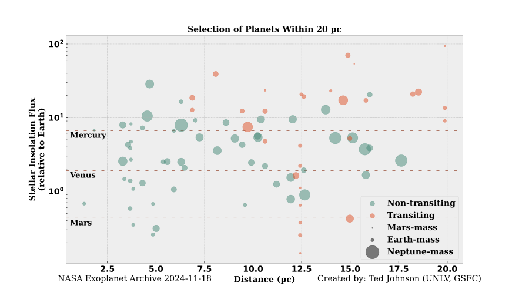

To get this figure, run:

```bash
$ python make_figure.py
```

There are also a variety of options:

```bash
$ python make_figure.py -h

usage: python make_figure.py [-h] [-t MAX_TEFF] [-d MAX_DIST] [-o OUTPUT] [-p MAX_PERIOD] [-m MAX_MASS] [-i MAX_INSOL]
                             [-s SIZE] [-a ALPHA] [--mirecle]

Creates a figure of nearby exoplanets.

options:
  -h, --help            show this help message and exit
  -t MAX_TEFF, --max_teff MAX_TEFF
                        Maximum effective temperature in K
  -d MAX_DIST, --max_dist MAX_DIST
                        Maximum distance in parsecs
  -o OUTPUT, --output OUTPUT
                        Output filename
  -p MAX_PERIOD, --max_period MAX_PERIOD
                        Maximum orbital period in days
  -m MAX_MASS, --max_mass MAX_MASS
                        Maximum planet mass in Earth masses
  -i MAX_INSOL, --max_insol MAX_INSOL
                        Maximum planet insolation in Earth fluxes
  -s SIZE, --size SIZE  Marker size scale factor
  -a ALPHA, --alpha ALPHA
                        Transparency
  --mirecle             Include MIRECLE target list
  --hwo                 Include HWO target list

Created by: Ted Johnson (GSFC 693) in Oct 2022, uploaded to Github 2023-04-07
```

### Plotly Implementation

This is for web apps.

The original code has been rewritten to generate a plotly figure. If you use a Python-based web infrastructure like ``Django``, you can just

```
from make_figure_plotly import main
fig = main(...)
```

You can find the documentation of this function in the source code, or in the terminal by running:

```
$ python3 -c "from make_figure_plotly import main;print(main.__doc__)"
  Make the figure with the given parameters.
    
    Parameters
    ----------
    max_teff : int
        The maximum effective temperature in K
    max_dist : float
        The maximum distance in parsecs
    max_period : float
        The maximum orbital period
    max_mass : float
        The maximum planet mass
    max_insolation : float
        The maximum insolation
    size : float
        A scalar for the marker size.
    alpha : float
        The transparency of the markers
    target_list : str
        'mirecle', 'hwo', or 'none'
    method : str
        How to decide on marker colors. 'transit' to separate them into
        transiting and non-transiting planets. 'teff' to color by stellar
        effective temperature.
    
    Returns
    -------
    go.Figure
        The plotly figure.

```